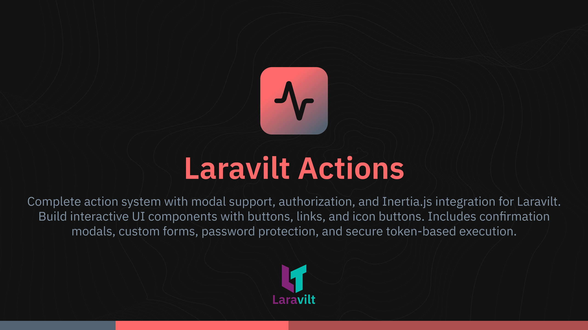

# Laravilt Actions

[](https://packagist.org/packages/laravilt/actions)
[](https://packagist.org/packages/laravilt/actions)
[](https://packagist.org/packages/laravilt/actions)
[](https://github.com/laravilt/actions/actions/workflows/dependabot/dependabot-updates)
[](https://github.com/laravilt/actions/actions/workflows/fix-php-code-styling.yml)
[](https://github.com/laravilt/actions/actions/workflows/tests.yml)

Complete action system with modal support, authorization, and Inertia.js integration for Laravilt. Build interactive UI components with buttons, links, and icon buttons. Includes confirmation modals, custom forms, password protection, and secure token-based execution.

## Features

- 🎨 **Multiple Variants** - Button, link, and icon button styles
- 🔒 **Authorization** - Closure-based authorization with record-level checks
- 📊 **Modal Support** - Confirmation modals, custom forms, slide-overs
- 🎯 **Flexible Configuration** - Colors, icons, sizes, tooltips
- 🔗 **URL Handling** - External URLs, internal actions, new tab support
- ⚡ **Inertia Integration** - Seamless Vue 3 integration

## Installation

```bash
composer require laravilt/actions
```

The package will automatically register its service provider.

## Quick Start

```php
use Laravilt\Actions\Action;

$action = Action::make('delete')
    ->label('Delete')
    ->icon('trash-2')
    ->color('danger')
    ->requiresConfirmation()
    ->modalHeading('Delete User')
    ->modalDescription('Are you sure?')
    ->action(function ($record) {
        $record->delete();
    });
```

## Generator Command

```bash
# Generate an action class
php artisan make:action ExportUserAction
```

## Documentation

- **[Complete Documentation](docs/index.md)** - Full feature guide, API reference, and examples
- **[MCP Server Guide](docs/mcp-server.md)** - AI agent integration

## Configuration

Publish the config file:

```bash
php artisan vendor:publish --tag="laravilt-actions-config"
```

## Assets

Publish the plugin assets:

```bash
php artisan vendor:publish --tag="laravilt-actions-assets"
```

## Testing

```bash
composer test
```

## Code Style

```bash
composer format
```

## Static Analysis

```bash
composer analyse
```

## License

The MIT License (MIT). Please see [License File](LICENSE.md) for more information.
